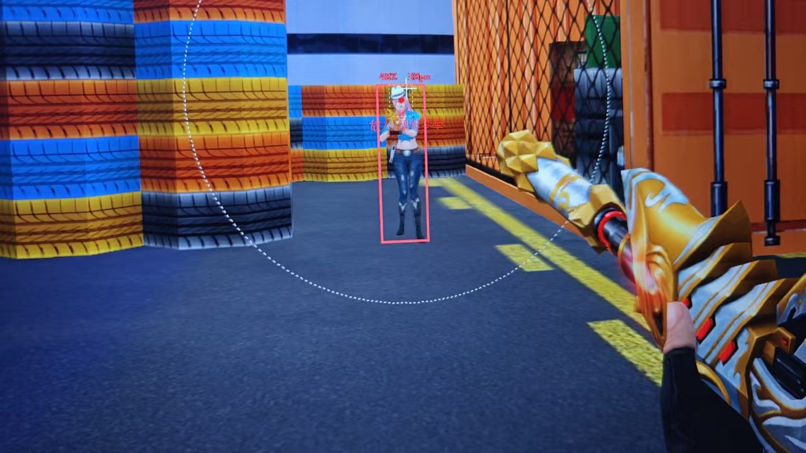
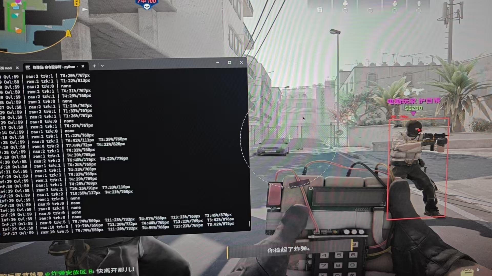
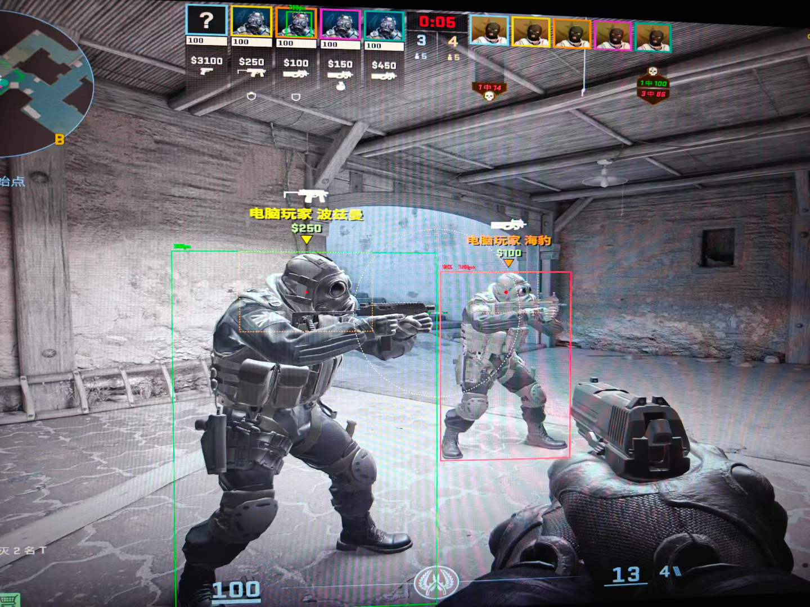

<h1 align="center">🎯 YOLO FPS Sentinel</h1>
<p align="center"><strong>实时 AI 目标检测 · 自适应吸附 · 透明浮窗</strong></p>
<p align="center">
  
  
  
  
  
</p>

---

## 概述

基于 [**YOLO26**](https://github.com/ultralytics/ultralytics)（Ultralytics 2026.01 发布，NMS-Free 端到端架构）的实时 FPS 游戏辅助系统。通过 DXGI 桌面捕获 + GPU 加速推理 + ByteTrack 多目标追踪 + Kalman 状态估计，实现亚帧级人物检测与智能瞄准辅助。

> ⚠️ **免责声明：本项目仅供 AI 研究与技术学习使用。请勿在正式游戏服务器中使用，由此产生的封号等后果与作者无关。**

---

## 特性

- 🔥 **YOLO26 NMS-Free** — 2026 年最新检测架构，端到端无后处理，速度与精度兼备
- ⚡ **三线程流水线** — 截帧 → 推理 → 追踪/渲染 并行，吞吐 60+ FPS
- 🎯 **智能目标锁定** — 按下即锁、松手释放、目标消失自动切换，杜绝来回跳变
- 🧠 **自适应平滑吸附** — 远近自适应步长 + 跳变检测 + EMA 去抖 + 死区防震
- 📐 **Kalman 状态估计** — 恒定速度模型 + 动态过程噪声，遮挡不丢目标
- 🪟 **透明浮窗** — DXGI 排除截屏 + WS_EX_TRANSPARENT 鼠标穿透，不影响操作
- 🧹 **手部/武器过滤** — 启发式规则过滤底部 HUD 与持枪手臂，专注敌人躯干
- 🔄 **Re-ID 重识别** — 短暂丢失后恢复同一 ID，不会把同一个敌人当新目标

---

## 架构

```
┌──────────────┐    frame_queue    ┌────────────────┐    detection_queue    ┌─────────────────┐
│ CaptureThread │ ───────────────→ │ InferenceThread │ ───────────────────→ │   Main Thread    │
│   (DXGI/GPU)  │                  │  (YOLO26 CUDA)  │                      │ Tracker + AIM +  │
│   ~60 FPS     │                  │   30~60 FPS     │                      │ Overlay  ~60 FPS │
└──────────────┘                  └────────────────┘                      └─────────────────┘
                                                                                  │
                                                                          ┌───────┴───────┐
                                                                          │ ByteTrack     │
                                                                          │ Kalman Filter │
                                                                          │ Target Lock   │
                                                                          │ Adaptive Aim  │
                                                                          │ Tkinter Ovl   │
                                                                          └───────────────┘
```

---

## 快速开始

### 环境

- Windows 10/11
- NVIDIA GPU（6GB+ VRAM，推荐 RTX 3060 及以上）
- CUDA 12.4+
- Python 3.12+

### 安装

```bash
# 1. 克隆仓库
git clone https://github.com/KaneTheo/yolo-fps-sentinel.git
cd yolo-fps-sentinel

# 2. 安装 PyTorch（CUDA 12.8 兼容 Python 3.14）
pip install torch torchvision --index-url https://download.pytorch.org/whl/cu128

# 3. 安装依赖
pip install ultralytics dxcam opencv-python pillow mss

# 4. 首次运行自动下载 yolo26n.pt（~5MB）
python -m fps_detector.main
```

### 使用

| 按键 | 功能 |
|------|------|
| **按住右键** | 激活吸附，鼠标自动移向最近敌人头部 |
| **F1** | 开关检测框显示 |
| **F2** | 退出程序 |
| **F10** | 保存当前帧截图 |

### 配置

所有参数集中在 [fps_detector/config.py](fps_detector/config.py)，关键项：

```python
MODEL_NAME = "yolo26n.pt"       # nano(5MB) / small(20MB) / medium(50MB)
INFERENCE_IMGSZ = 960           # 推理分辨率，RTX3060 推荐 960
AIM_SPEED = 0.8                 # 吸附速度（0-1，越大越快）
AIM_FOV = 400                   # 吸附视野（像素）
AIM_DEADZONE = 30               # 死区，小于此距离不动鼠标
AIM_TRIGGER_KEY = "rmb"         # 触发键（rmb/lmb/shift/ctrl/alt）
```

---

## 目录结构

```
yolo-fps-sentinel/
├── fps_detector/
│   ├── main.py          # 入口：三线程调度 + 主循环
│   ├── config.py        # 所有可调参数
│   ├── detector.py      # YOLO26 推理 + 检测后处理
│   ├── tracker.py       # ByteTrack + Kalman 多目标追踪
│   ├── aim.py           # Windows SendInput 鼠标吸附
│   ├── overlay.py       # tkinter 透明浮窗渲染
│   └── capture.py       # DXGI/MSS 屏幕捕获
├── detect_image.py      # 入门：单张图片检测
├── person_detect.py     # 入门：摄像头实时检测
├── requirements.txt     # 依赖列表
└── README.md
```

---

## 技术细节

### 为什么不用 Kalman 输出坐标？

CS 人物急停急动，恒定速度 Kalman 的 `predict()` 步骤天然滞后 1 帧。本项目中 Kalman 只在后台估计速度，目标可见时 **直接用 YOLO 原始坐标**，零滤波延迟；仅在遮挡时用预测值填补。

### 目标锁定 vs 最近目标切换

松开右键重新按下时锁定新目标，按住期间同一个 track_id 不换人。目标消失则自动切换到 FOV 内新的最近目标，无需手动重锁。

### 自适应吸附算法

```
if dist > 150px:  MAX_STEP = 40   # 远距：大步追
elif dist > 80:   MAX_STEP = 30   # 中距
elif dist > 40:   MAX_STEP = 18   # 近距：精细控制
else:             MAX_STEP = 10   # 贴脸：微调

step = min(dist * speed, MAX_STEP)  # 剩余距离比例 + 硬上限
```

---

## 性能参考

| 模型 | 推理分辨率 | GPU | 推理 FPS |
|------|-----------|-----|----------|
| yolo26n | 960 | RTX 3060 Laptop | 40-60 |
| yolo26n | 1440 | RTX 3060 Laptop | 8-25 ❌ |
| yolo26s | 960 | RTX 3060 Laptop | 30-45 |
| yolo26m | 960 | RTX 3060 Laptop | 20-30 |

---

## Roadmap

- [ ] 自定义 CS 游戏模型（COCO 泛化能力有限，训练专用数据集可大幅提升）
- [ ] 骨骼关键点检测（提升瞄准点精度）
- [ ] 多显示器支持
- [ ] 录制回放分析

---



